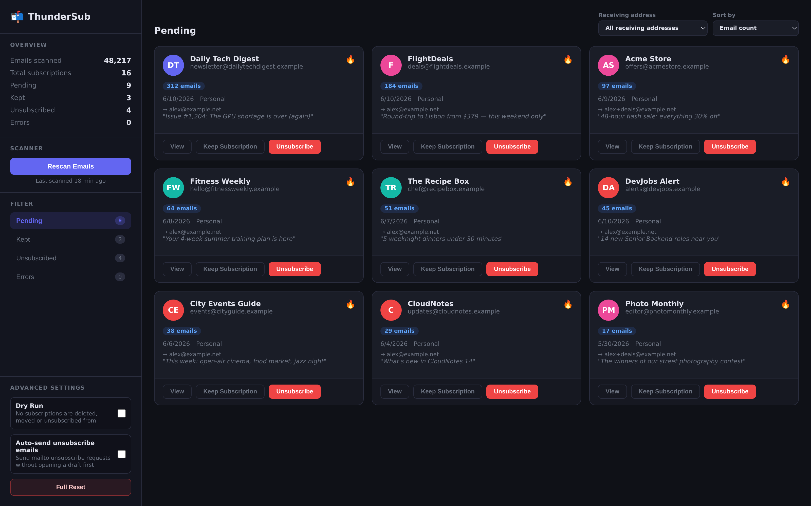
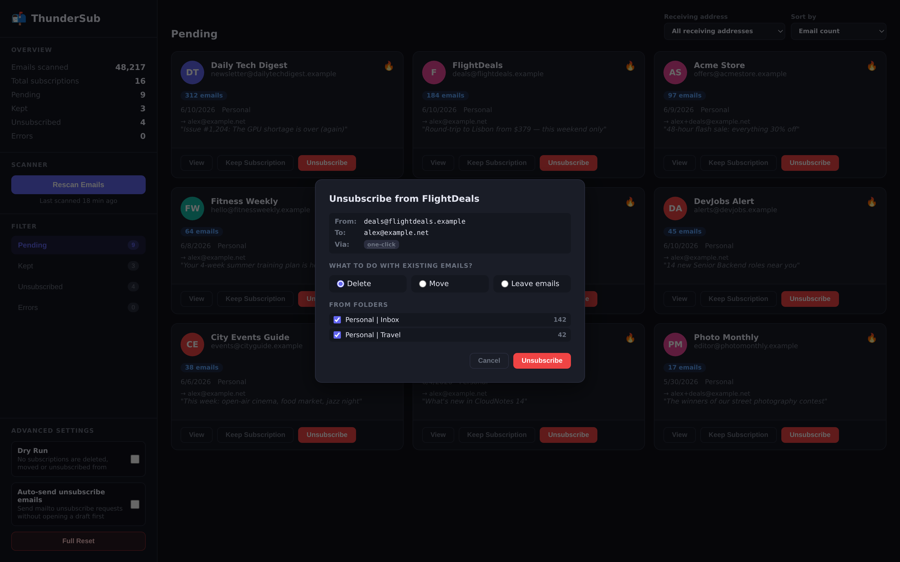
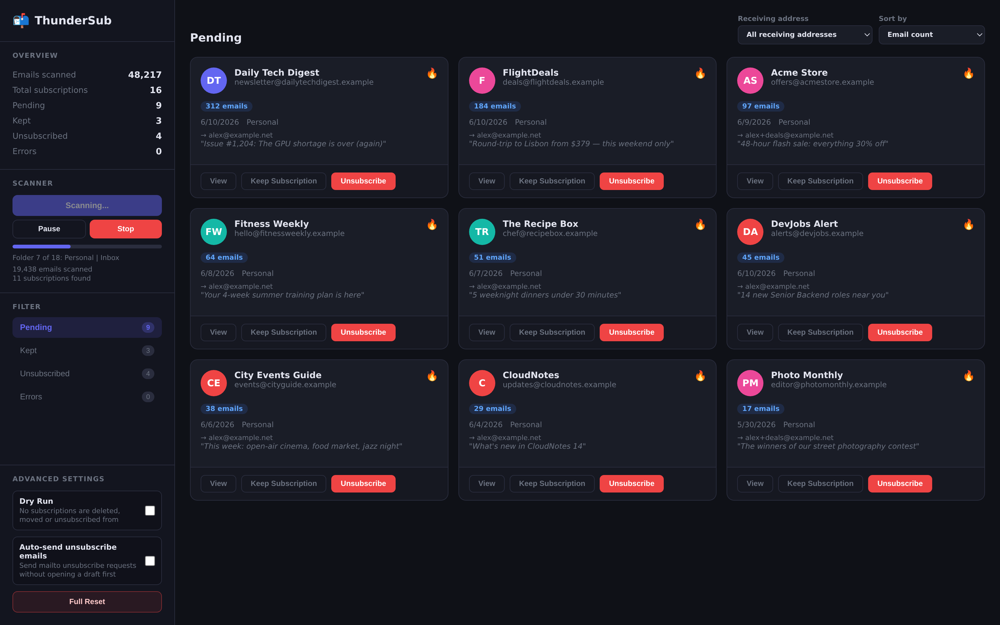
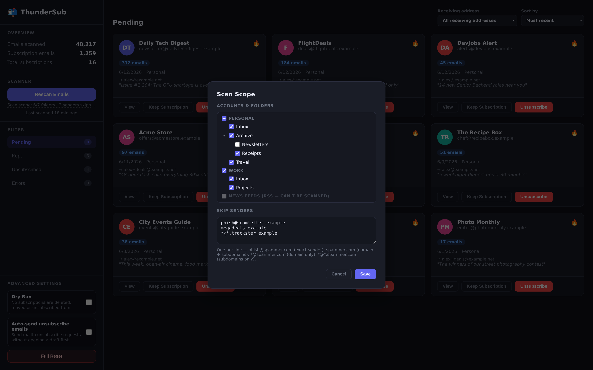
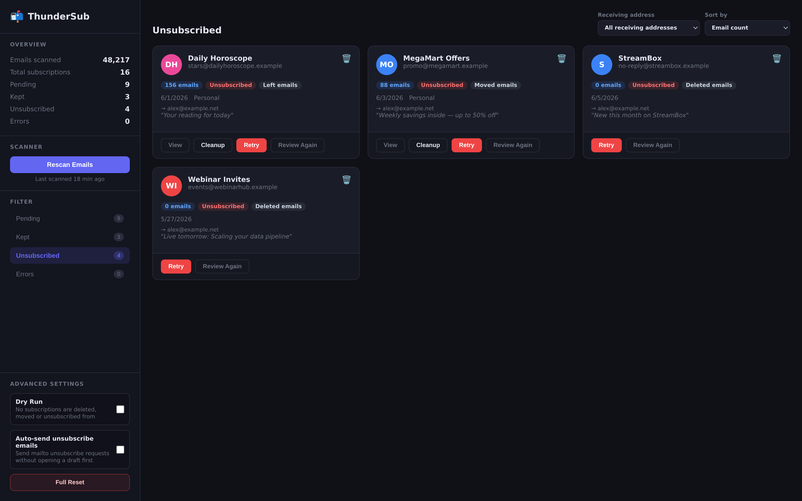

# ⚡ ThunderSub

**Take back your inbox.** ThunderSub scans every folder in your Thunderbird mail accounts, finds every mailing list you've ever been signed up to, and gives you one place to unsubscribe from all of them — and clean up the thousands of emails they left behind.

No cloud service. No account. No one reading your mail. Everything runs locally inside Thunderbird.



| Unsubscribe & clean up in one step | Live scan progress |
|---|---|
|  |  |
| **Choose exactly what gets scanned** | **Track what you've left** |
|  |  |

---

## Why ThunderSub?

Your inbox didn't get noisy overnight. It happened one newsletter, one "special offer," one forgotten signup at a time — across years and across every address you own. Cleaning it up by hand means hunting for a tiny unsubscribe link at the bottom of each email, one sender at a time.

ThunderSub turns that chore into a review queue:

1. **Scan once.** ThunderSub walks all your accounts and folders and builds a list of every subscription it can detect.
2. **Decide fast.** Each sender becomes a card: who they are, how many emails they've sent you, which address they're hitting, when they last wrote. Keep it or kill it.
3. **Unsubscribe properly.** ThunderSub picks the best available unsubscribe method automatically — and can delete or file away the sender's entire back catalog in the same click.

Services that do this for webmail exist — and they do it by reading your email on their servers. ThunderSub is the desktop-native answer: **your mail never leaves your machine.**

## Features

### 🔍 Deep subscription detection
- Reads the standard `List-Unsubscribe` header (RFC 2369) and detects **one-click unsubscribe** support (RFC 8058).
- Goes further: parses email bodies (HTML *and* plain text) to find **embedded unsubscribe links** in 13 languages (English, Dutch, German, French, Spanish, Italian, Portuguese, Polish, Swedish, Danish, Norwegian, Finnish, and Russian) when senders don't play by the rules.
- Smart enough to skip quoted and forwarded content, so a newsletter your friend forwarded you doesn't show up as *your* subscription.
- Scans every folder across your mail accounts — skipping News/NNTP, RSS/Feeds, Junk, Trash, Sent, Drafts, and Gmail's "All Mail" duplicates by default, with folder controls to include them when needed.
- Long mailbox? Scans can be **paused, resumed, or stopped** at any time, and partial results are saved.

### 🎯 Scan scope
- **Pick your folders**: untick whole accounts or individual folders (that 20,000-message archive backup, say) in a checkbox tree. Everything new is included by default.
- **Skip senders before they're even read**: list patterns one per line — `phish@spammer.com` (exact sender), `spammer.com` (domain + subdomains), `*@spammer.com` (domain only), `*@*.spammer.com` (subdomains only).
- The active scope is always summarised under the Scan button, so a narrowed scan can't masquerade as a broken one.

### 📬 Alias-aware grouping
ThunderSub doesn't just group by sender — it groups by **(sender, receiving address)**. If `news@example.com` mails both `you@work.com` and `you+shopping@gmail.com`, you'll see two cards, because those are two subscriptions that need two unsubscribes. Mailing-list and forwarded mail is resolved against your configured Thunderbird identities so cards land under the right address.

### ✂️ Four ways out
For each sender, ThunderSub auto-selects the best available method:

| Method | What happens |
|---|---|
| **One-click** | A silent, standards-compliant POST request. You never leave Thunderbird. |
| **Email** | An unsubscribe email is prepared. By default it opens as a **draft for your review**; flip one setting and it sends automatically. |
| **Browser** | The sender's unsubscribe page opens in your default browser. |
| **Embedded link** | The unsubscribe link found in the email body opens in your browser. |

Did a one-click request bounce? Hit **Retry** and pick any other detected method from a dropdown.

### 🧹 Cleanup, not just unsubscribe
Unsubscribing stops *future* email. ThunderSub also handles the past:

- **Delete** every email from a sender (to Trash — never permanently), or
- **Move** them to any folder — pick from a folder tree, or create a new folder on the spot,
- with **per-folder control**: act on the sender's emails in Inbox but leave the ones you filed in Receipts alone.

If a cleanup fails (folders move, servers hiccup), your unsubscribe still counts — the emails stay put and a **Cleanup** button lets you retry just that part.

### 🛟 Dry-run mode
Want to explore risk-free first? Flip the **Dry Run** toggle and every unsubscribe, delete, and move is simulated and reported ("would delete 142 emails") without touching anything — try the whole workflow end to end, then switch it off when you trust it.

### 📊 A review dashboard, not a black box
- Stats at a glance: emails scanned, subscriptions found, pending / kept / unsubscribed / errors.
- Filter cards by status or by receiving address; sort by email volume or most recent.
- **Keep** the newsletters you actually read, **dismiss** dead entries, or send anything back to Pending with **Review Again**.
- Failed unsubscribes land in an **Errors** tab with the reason — nothing silently disappears.
- **View** any subscription to open its emails right in Thunderbird, pre-filtered by sender.
- Rescans **preserve your decisions**: senders you kept or unsubscribed stay that way; new senders show up as pending.

### 🔒 Private by design
- All data lives in Thunderbird's local extension storage. **Nothing is uploaded, ever.**
- No telemetry, no analytics, no accounts, no third-party services.
- The only network requests ThunderSub makes are the unsubscribe actions **you** explicitly trigger.
- A **Full Reset** wipes everything it stored, any time.

## Installation

ThunderSub requires **Thunderbird 128 or later**.

ThunderSub **has not yet completed review**. Its
[Thunderbird add-on details page](https://addons.thunderbird.net/en-US/thunderbird/addon/thundersub/)
can be accessed directly, but it is not yet listed in the add-on gallery and cannot be found through
Thunderbird's add-on search. For now, install it manually from the `.xpi` file:

1. Open the [ThunderSub add-on listing](https://addons.thunderbird.net/en-US/thunderbird/addon/thundersub/) and download the `.xpi` file.
2. In Thunderbird, open the **≡ menu** and select **Add-ons and Themes**.
3. Select the **settings gear icon**, then **Install Add-on From File…**.
4. Pick the downloaded `.xpi` file and confirm the installation.

Because review is not yet complete, new versions may also need to be downloaded and installed
manually.

### Install from source

```bash
git clone https://github.com/SmarakNayak/thundersub.git
cd thundersub
bash build.sh   # creates dist/thundersub-<version>.xpi
```

Install the built `.xpi` using the same **Add-ons and Themes** → **settings gear icon** →
**Install Add-on From File…** steps above. For development, load it temporarily through
**Tools → Developer Tools → Debug Add-ons → Load Temporary Add-on**, then select `manifest.json`.

## Quick start

1. Click the **ThunderSub** icon in the toolbar, then **Open ThunderSub**.
2. Hit **Scan Emails** and watch the progress bar. (Pause or stop any time — results so far are kept.)
3. Work through the **Pending** tab:
   - **Keep Subscription** for the ones you want,
   - **Unsubscribe** for the rest — choose what happens to existing emails (delete / move / keep) in the same dialog.
4. Want to click around freely first? Switch on the **Dry Run** toggle in the sidebar — every action is then simulated and reported instead of executed.

## Permissions explained

| Permission | Why ThunderSub needs it |
|---|---|
| `messagesRead` | Read headers and bodies to detect subscriptions. |
| `messagesMove`, `messagesDelete` | The optional cleanup actions (move to folder / delete to Trash). |
| `accountsRead`, `accountsFolders` | List your accounts and folders to scan, and build the move-destination tree. |
| `compose`, `compose.send` | Prepare (and, only if you enable auto-send, send) `mailto:` unsubscribe emails. |
| `storage` | Save scan results and your decisions locally. |
| `<all_urls>` | Send one-click (RFC 8058) unsubscribe POST requests to whatever domain the sender specifies. URLs are validated first: public `https://` endpoints only — localhost, private-network IPs, and internal hostnames are refused. |

## FAQ

**Is it safe to let it delete emails?**
Deletes go to your Trash folder, never permanent deletion — and with the dry-run toggle on, nothing is touched at all. Move operations re-resolve messages by their stable RFC 5322 Message-ID right before acting, so stale data from an old scan can't delete the wrong thing.

**Will unsubscribe emails be sent without me seeing them?**
No. By default, email-based unsubscribes open as a **draft** in a compose window for you to review and send. There's an explicit opt-in toggle if you'd rather they send automatically.

**Does clicking unsubscribe links confirm my address to spammers?**
For legitimate senders, `List-Unsubscribe` is the sanctioned, safe path — it's the same mechanism Gmail and Apple Mail use. For sketchy senders, prefer **Keep** + delete, or just dismiss the card; ThunderSub never auto-fires any unsubscribe without your click.

**What happens when I rescan?**
New subscriptions appear as Pending. Your Keep and Unsubscribed decisions carry over. Past errors are cleared for a fresh evaluation.

**Where is my data stored?**
In Thunderbird's local extension storage on your machine. **Full Reset** in the sidebar clears it completely.

## Project layout

```
manifest.json    Extension manifest (Thunderbird MailExtension, MV2)
background.js    Scanner, subscription store, unsubscribe + cleanup actions
popup/           Toolbar popup (quick stats + open button)
tab/             The main dashboard UI
icons/           SVG icons
```

No build step, no dependencies, no framework — plain JavaScript on the [Thunderbird WebExtension APIs](https://webextension-api.thunderbird.net/).

## Contributing

Bug reports and pull requests are welcome. Useful context for hacking:

- Subscriptions are keyed by `senderEmail|recipientAddress` and stored via `browser.storage.local`.
- Message references are stored as RFC 5322 Message-IDs and re-resolved to live message ids before any delete/move, because Thunderbird's numeric ids don't survive restarts.
- The UI talks to the background script exclusively through `browser.runtime.sendMessage` commands — see the handler at the bottom of `background.js` for the full API surface.

## License & acknowledgements

ThunderSub is licensed under the [Mozilla Public License 2.0](LICENSE).

It was inspired by [BetterUnsubscribe](https://github.com/LucBennett/BetterUnsubscribe) by Luc Bennett (MPL-2.0), which pioneered convenient one-click / email / web / embedded-link unsubscribing in Thunderbird. ThunderSub extends the idea from a per-message button to whole-mailbox scanning, review, and cleanup.

---

**ThunderSub** — by [Smarak Nayak](https://github.com/SmarakNayak). Scan it, sort it, silence it.
